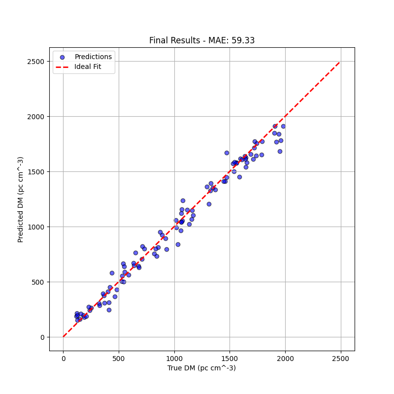

# FRB Dispersion Measure Predictor

This project uses Deep Learning to predict the Dispersion Measure (DM) of Fast Radio Bursts (FRBs) from raw telescope spectrograms.

The core innovation of this model is a "Sim-to-Real" workflow. Because real telescope data is noisy and scarce, the model is trained entirely on Physics-Aligned Synthetic Data generated with realistic artifacts (RFI stripes, scattering, and channel noise). By learning to read dirty synthetic signals, the model successfully generalizes to predict DM values from real CHIME telescope observations with high accuracy.

## Final Results

Below is the evaluation on real telescope data, showing the correlation between the True DM and the Predicted DM.

