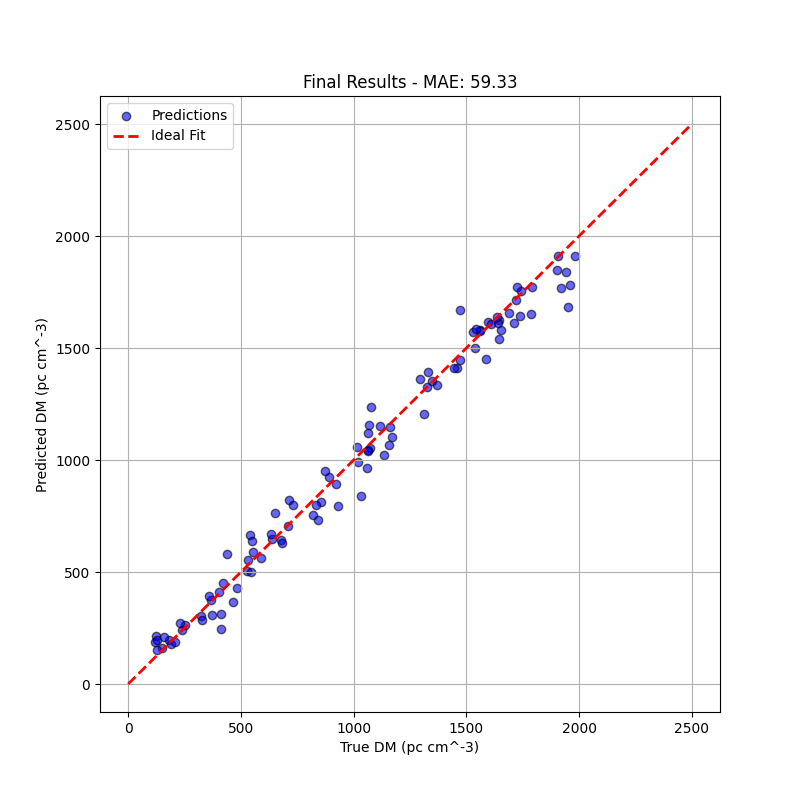

# FRB Dispersion Measure Predictor

This project uses Deep Learning to predict the Dispersion Measure (DM) of Fast Radio Bursts (FRBs) from raw telescope spectrograms (waterfall plots).

Fast Radio Bursts (FRBs) are millisecond-duration radio transients of extragalactic origin.
A key physical parameter used to characterize FRBs is the Dispersion Measure (DM), that is traditionally estimated using computationally expensive brute-force de-dispersion techniques. It tells about the total electron column density along the line of sight, helping scientists understand the universe's structure and evolution, from local galaxies to the early cosmos.

The main challenge in FRB detection is the scracity of labelled real world data and high levels of noise (RFI) in telescopic observations. The core innovation of this model is a "Sim-to-Real" workflow. As real telescope data is noisy and scarce, the model is trained on Physics-Aligned Synthetic Data generated with realistic artifacts (RFI stripes, scattering, and channel noise). By learning to read dirty synthetic signals, the model successfully generalizes to predict DM values from real CHIME telescope observations with high accuracy.

Radio waves travel at different speeds through the ionized plasma of deep space. Lower frequency waves arrive later than the higher frequency ones. That delay is determined by the dispersion measure, which represents the column density of electron us and the source.

## Final Results

Below is the evaluation on real telescope data, showing the correlation between the True DM and the Predicted DM.

I will be adding the comments to most of the files at the end of the project and try to explain the astronomical concepts and formuals required to understand and complete the project.
Note- explained some files with too many comments/explanation as physics field knowledge is required for that part

playlist that helped me throughout the project and forever - https://www.youtube.com/watch?v=2S1dgHpqCdk&list=PLhhyoLH6IjfxeoooqP9rhU3HJIAVAJ3Vz
